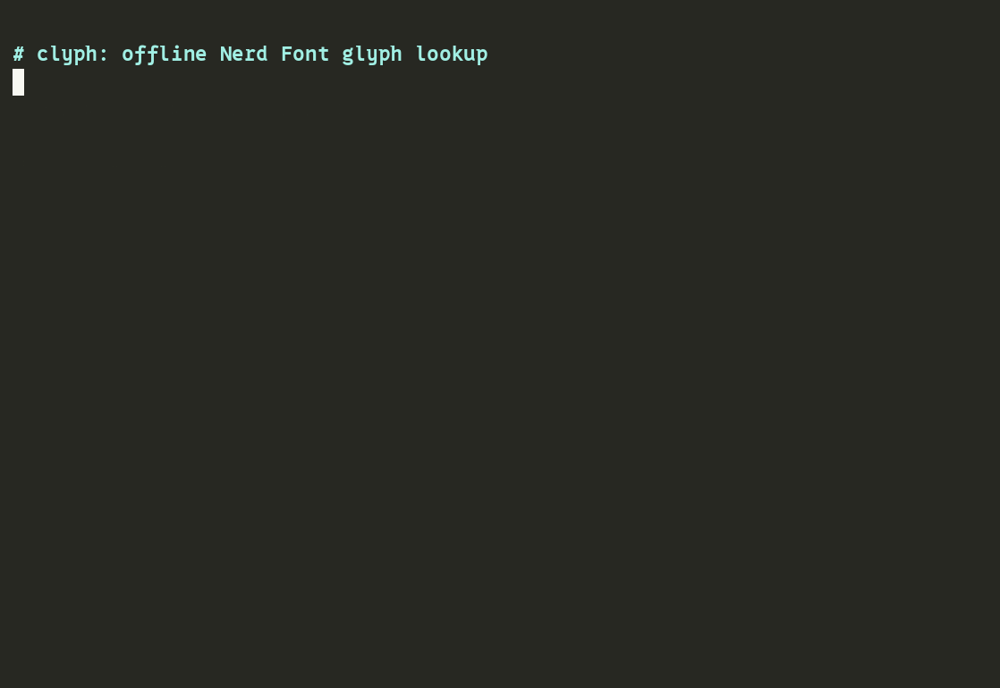

# clyph
[](https://pkg.go.dev/github.com/dabito/clyph)
[](LICENSE)
[](https://github.com/dabito/clyph/tags)

`clyph` is a Nerd Font glyph lookup CLI for shell scripts, status lines, and agent-friendly UI work.

Search glyph names, print exact glyphs, return codepoints, and refresh a local offline catalog from Nerd Fonts CSS.

## Why clyph?

Nerd Font glyphs are useful in prompts, status lines, TUIs, scripts, and agent-facing output, but searching web pages and copying codepoints by hand is slow. `clyph` makes glyphs local and scriptable: search offline, print the exact character, reverse-lookup a pasted glyph, format codepoints for CSS/HTML/JS, and resolve semantic names like `success` for stable visual language.

Built for AI coding agents: small local tools, typed inputs, deterministic text output, bounded context, and explicit failure modes.

Repo: <https://github.com/dabito/clyph> · Issues: <https://github.com/dabito/clyph/issues>

## Demo



Recorded terminal demo source: [`docs/demo/clyph.cast`](docs/demo/clyph.cast)

Play locally:

```bash
asciinema play docs/demo/clyph.cast
```

The demo shows: catalog scale (`stats`, `families`), name search, printing a glyph, format conversion (`fmt` → html/css/unicode/js/hex/octal), reverse lookup (`identify`), scripting glyphs into status messages and status lines, and resolving a glyph by a live `alias` — all offline.

## Requirements

- Go 1.22 or later
- No external dependencies — uses Go standard library only
- A terminal/font with Nerd Font glyphs installed to render `glyph`/`search` output correctly; without it, glyph columns show as boxes or blanks

## Install

```bash
go install github.com/dabito/clyph@latest
```

Go installs the binary into `$GOBIN`, or `$GOPATH/bin` when `GOBIN` is unset. Default Go setups usually use:

```text
$HOME/go/bin/clyph
```

Ensure Go's bin dir is on `PATH`:

```bash
export PATH="$HOME/go/bin:$PATH"
```

## Initialize catalog

Lookups use a local catalog. Refresh it once after install:

```bash
clyph update
```

Default source:

```text
https://www.nerdfonts.com/assets/css/webfont.css
```

Default catalog path:

```text
~/.clyph/data/catalog.json
```

Environment override:

```bash
export CLYPH_CATALOG_PATH="$PWD/data/catalog.json" # exact catalog file override
```

## Usage

```bash
clyph search circle --limit 5
clyph get nf-md-check
clyph glyph nf-md-check
clyph codepoint nf-md-check
clyph update --source ./webfont.css
clyph identify 󰄬                   # reverse lookup: glyph char -> name/codepoint/family
clyph fmt nf-md-check --format css # one name -> html/css/unicode/js/hex/octal
clyph export --names nf-md-check --format ts # generate typed icon modules/assets
clyph semantic success             # concept -> canonical glyph (seed + aliases)
clyph families --limit 5           # per-family glyph counts (md, fa, dev, ...)
clyph stats                        # total records, families, labeled, aliased
clyph label nf-md-check "checkmark"
clyph alias nf-md-check add tick
clyph version
```

Use JSON for scripts:

```bash
clyph search circle --json
clyph get nf-md-check --json
clyph glyph nf-md-check --json
clyph codepoint nf-md-check --json
clyph update --json
clyph label nf-md-check "checkmark" --json
clyph export --semantic success,warning --format json
clyph alias nf-md-check add tick --json
```

Errors are JSON too when `--json` is passed, on every command, so scripts never have to fall back to parsing stderr text:

```bash
$ clyph get nf-does-not-exist --json
{
  "error": "not found: nf-does-not-exist"
}
```

Default plain output is tab-separated for scripts. In a terminal, tab stops make columns drift out of alignment once names vary in length — pass `--pretty` for space-padded, human-readable columns instead:

```bash
clyph search hand --pretty --limit 5
```

Print a glyph inside shell output:

```bash
printf "status: %s done\n" "$(clyph glyph nf-md-check)"
```

## Sample output

```text
$ clyph search circle --limit 5
nf-cod-arrow_circle_down	ebfc		-
nf-cod-arrow_circle_left	ebfd		-
nf-cod-arrow_circle_right	ebfe		-
nf-cod-arrow_circle_up	ebff		-
nf-cod-circle	eabc		-
showing 1-5 of 352 matches; use --offset/--limit to see more

$ clyph get nf-md-check
nf-md-check	f012c	󰄬	-

$ clyph search hand --pretty --limit 3
nf-dev-handlebars     e7f7  -
nf-fa-hand            f256  -
nf-fa-hand_back_fist  f255  -

$ clyph update --json
{
  "status": "updated",
  "records": 10764,
  "catalog": "/home/user/.clyph/data/catalog.json"
}
```

Plain output is tab-separated: `name`, `codepoint`, `glyph`, `label`. Use `--json` for stable machine-readable output, or `--pretty` (search only) for space-aligned columns in a terminal.

## Commands

```text
clyph search <query> [--limit N] [--offset N] [--json] [--pretty]
clyph get <name> [--json]
clyph glyph <name> [--json]
clyph codepoint <name> [--json]
clyph identify <glyph...> [--json]   (reads glyphs from stdin if none given)
clyph fmt <name> [--format html|css|unicode|js|hex|octal|all] [--json]
clyph export [--format json|css|ts|go] [--names a,b] [--family nf-md|md] [--semantic success,warning] [--output <path>]
clyph semantic <concept> [--all] [--json]
clyph families [--limit N] [--json]
clyph stats [--json]
clyph update [--source <file-or-url>] [--json]
clyph label <name> <text> [--json]
clyph label <name> --clear [--json]
clyph alias <name> <add|rm> <value> [--json]
clyph version
```

Any subcommand accepts `--help`/`-h` for a one-line usage reminder, e.g. `clyph label --help`.

Value flags (`--limit`, `--offset`, `--source`, `--format`, `--names`, `--family`, `--semantic`, `--output`) accept either `--flag value` or `--flag=value`.

## Behavior notes

- **search --limit / --offset**: `--limit N` caps results to N; default is 100. `--offset N` skips the first N matches, for paging past the limit. `--limit 0` returns zero matches. Negative values for either flag are rejected with exit code 2. Truncation is never silent: when the page doesn't cover every match, plain output prints `showing START-END of TOTAL matches; use --offset/--limit to see more` to stderr, and `--json` output includes `total` and `offset` fields alongside `matches` so scripts can detect truncation without an extra request.
- **JSON omits empty `label`/`aliases`**: a record's `label` and `aliases` fields are left out of JSON output entirely when unset, instead of appearing as `"label": ""` and `"aliases": []`. Keeps output smaller for the common case where neither is set.
- **Fast catalog cache**: JSON remains the canonical catalog. On first load, clyph writes a disposable gob cache next to it (`catalog.cache.gob`); later runs use the cache when it is newer than the JSON. Delete the cache anytime — clyph will rebuild it.
- **search --pretty**: default plain output is tab-separated (`\t`), which relies on the terminal's fixed tab stops and drifts out of alignment once a name is longer than one tab stop — exactly the case for most Nerd Font names. `--pretty` space-pads the name and codepoint columns to the widest value in the result set instead. Script-facing default output is unchanged; `--pretty` is opt-in and ignored with `--json`.
- **search matches underscores and spaces interchangeably**: Nerd Font names use underscores (`arrow_circle_down`); `clyph search "arrow circle"` normalizes both the query and catalog text so either form matches.
- **Multi-rune CSS content**: Nerd Fonts CSS `content` values containing multiple Unicode escapes (e.g. `"\f444\f555"`) collapse to the first rune. Only the first codepoint is recorded; subsequent runes are dropped.
- **Label and alias assignment**: `clyph label <name> <text>` sets a record's label (`--clear` removes it); `clyph alias <name> add|rm <value>` manages its alias list. `clyph update` then preserves these across a catalog refresh — only glyphs absent from the new source are removed.
- **Semantic seed**: `clyph semantic <concept>` resolves from the embedded `data/semantic.json` seed first, then exact `label`/`alias` matches. Unknown concepts fall back to name search with `--all`. Set `CLYPH_SEMANTIC_PATH` to test or use a custom concept map.
- **Export selection**: `clyph export` writes the whole catalog when no selector is passed. `--names`, `--family`, and `--semantic` select records by exact name, Nerd Font family, and concept respectively; duplicates collapse and output is sorted by glyph name. `--output` writes atomically to a file; omit it or use `-` for stdout.

## Failure modes

- **Missing catalog**: every lookup command fails with exit code `1` until `clyph update` has been run once. The error names the expected path and points at `clyph update`.
- **Empty search**: `clyph search <query>` with no matches prints nothing and exits `0`; pass `--json` to get an empty `matches` array.
- **Bad CSS source**: `clyph update --source <file-or-url>` rejects a source that parses to zero glyph records (exit `1`) and leaves the existing catalog untouched.
- **Network failure**: `clyph update` against a URL reports `update failed: ...` and exits `1` without modifying the catalog.
- **Unknown name**: `clyph get|glyph|codepoint|label|alias <name>` prints `not found: <name>` and exits `1`; with `--json`, the same message comes back as `{"error": "not found: <name>"}`.

## Development

```bash
make test
make vet
make check
make install
```

Manual install from local checkout:

```bash
go install .
```
